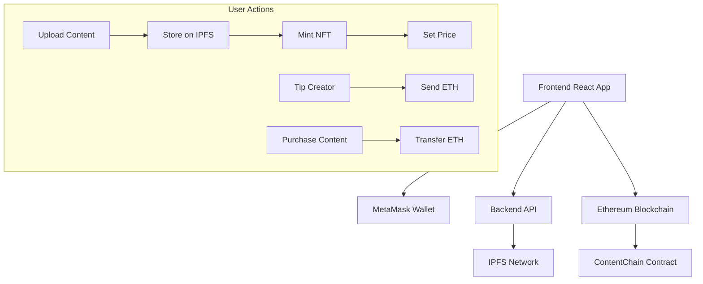

# ContentChain Project Structure

## 📁 Complete Directory Structure

```
contentchain/
├── 📄 README.md                    # Project documentation
├── 📄 PROJECT_STRUCTURE.md         # This file - structure overview
├── 📄 .gitignore                   # Git ignore rules
├── 📄 package.json                 # Root package configuration
├── 📄 hardhat.config.js            # Hardhat blockchain configuration
│
├── 📁 contracts/                   # 🧠 Smart Contracts
│   └── 📄 ContentChain.sol         # Main NFT content contract
│
├── 📁 backend/                     # 🔧 API Server
│   ├── 📄 package.json             # Backend dependencies
│   ├── 📄 server.js                # Express server & API endpoints
│   ├── 📄 .env.example             # Environment variables template
│   └── 📁 uploads/                 # Temporary file uploads
│
├── 📁 frontend/                    # 🎨 React Frontend
│   ├── 📄 package.json             # Frontend dependencies
│   ├── 📄 next.config.js           # Next.js configuration
│   ├── 📄 tailwind.config.js       # Tailwind CSS configuration
│   ├── 📄 postcss.config.js        # PostCSS configuration
│   ├── 📄 _app.js                  # Next.js app wrapper
│   │
│   ├── 📁 pages/                   # Next.js pages
│   │   └── 📄 index.js             # Main application page
│   │
│   ├── 📁 components/              # React components
│   │   └── 📄 (future components)
│   │
│   ├── 📁 styles/                  # CSS styles
│   │   └── 📄 globals.css          # Global Tailwind styles
│   │
│   └── 📁 src/                     # Source files
│       └── 📁 artifacts/           # Compiled contract artifacts
│           └── 📄 ContentChain.json # Contract ABI & bytecode
│
├── 📁 scripts/                     # 🚀 Deployment Scripts
│   └── 📄 deploy.js                # Contract deployment script
│
└── 📁 cache/                       # ⚡ Hardhat cache (auto-generated)
    └── 📁 artifacts/               # Contract compilation artifacts
```

## 🏗️ Architecture Overview

### **Smart Contract Layer** (`contracts/`)
- **Purpose**: Blockchain logic for content ownership & monetization
- **Technology**: Solidity, OpenZeppelin, ERC721
- **Key Features**:
  - NFT minting for content ownership
  - IPFS hash storage
  - Tipping mechanism
  - Purchase system
  - Creator controls

### **Backend API Layer** (`backend/`)
- **Purpose**: Server-side logic & external integrations
- **Technology**: Node.js, Express, IPFS
- **Key Features**:
  - File upload to IPFS
  - Contract interaction endpoints
  - Content management API
  - Environment configuration

### **Frontend Application** (`frontend/`)
- **Purpose**: User interface & Web3 integration
- **Technology**: Next.js, React, Tailwind CSS, Ethers.js
- **Key Features**:
  - Wallet connection (MetaMask)
  - Content upload interface
  - Tipping & purchase UI
  - Responsive design

### **Development Tools** (`scripts/`, `hardhat.config.js`)
- **Purpose**: Development & deployment automation
- **Technology**: Hardhat, Node.js
- **Key Features**:
  - Local blockchain setup
  - Contract compilation
  - Automated deployment
  - Testing framework

## 🔗 Component Interactions



## 📋 File Responsibilities

### **Core Files**
- `ContentChain.sol` - Main smart contract with all business logic
- `server.js` - Express server with all API endpoints
- `index.js` - React frontend with Web3 integration
- `deploy.js` - Contract deployment automation

### **Configuration Files**
- `hardhat.config.js` - Blockchain network & compiler settings
- `package.json` - Dependencies & scripts for each component
- `.env.example` - Environment variable template
- `tailwind.config.js` - Frontend styling configuration

### **Supporting Files**
- `.gitignore` - Version control exclusions
- `README.md` - Project documentation & setup guide
- `globals.css` - Global styling definitions

## 🚀 Development Workflow

1. **Smart Contract Development**
   - Edit `contracts/ContentChain.sol`
   - Run `npx hardhat compile`
   - Test with `npx hardhat test`

2. **Backend Development**
   - Edit `backend/server.js`
   - Add new API endpoints
   - Test with `npm run dev`

3. **Frontend Development**
   - Edit `frontend/pages/index.js`
   - Add new components in `frontend/components/`
   - Test with `npm run dev`

4. **Integration Testing**
   - Deploy contract: `npx hardhat run scripts/deploy.js`
   - Start backend: `cd backend && npm run dev`
   - Start frontend: `cd frontend && npm run dev`

## 🔧 Technology Stack Summary

| Layer | Technology | Purpose |
|-------|------------|---------|
| **Blockchain** | Ethereum, Solidity | Smart contracts & NFTs |
| **Storage** | IPFS | Decentralized file storage |
| **Backend** | Node.js, Express | API server & integrations |
| **Frontend** | Next.js, React | User interface |
| **Styling** | Tailwind CSS | Modern responsive design |
| **Web3** | Ethers.js, Web3Modal | Blockchain interaction |
| **Development** | Hardhat | Blockchain development tools |

## 📝 Next Steps for Enhancement

1. **Testing**: Add unit tests for contracts and API
2. **Components**: Break down frontend into reusable components
3. **Security**: Add contract audits and security measures
4. **Scaling**: Implement Layer 2 solutions
5. **Features**: Add content categories, search, and discovery
